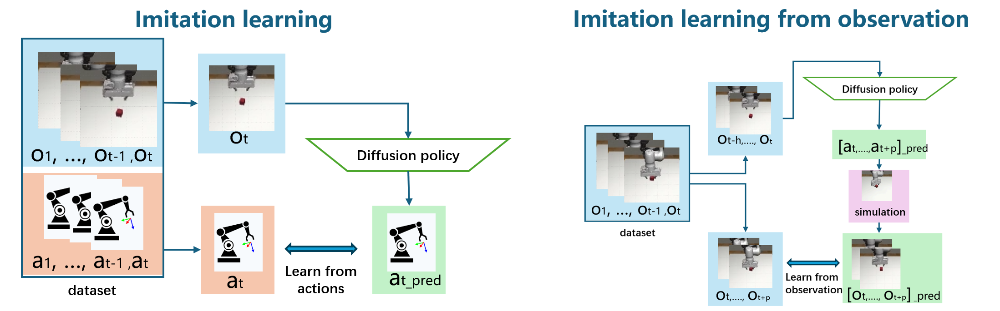
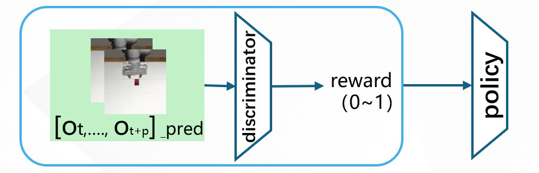
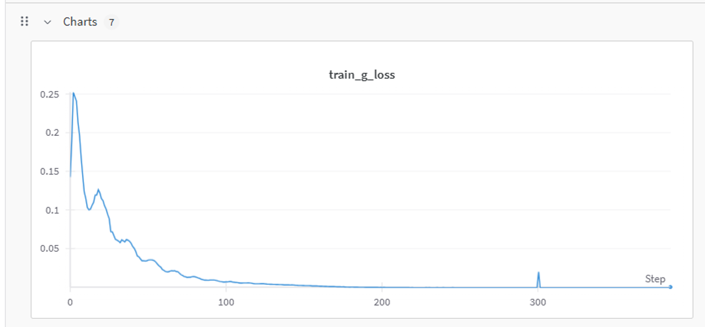
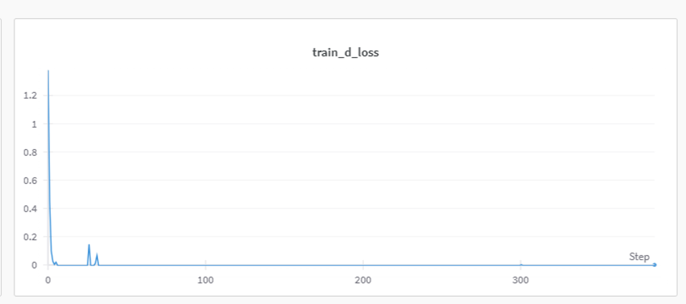
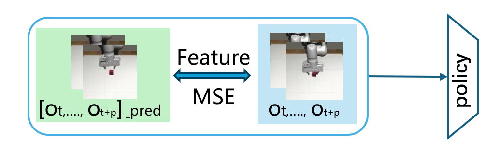
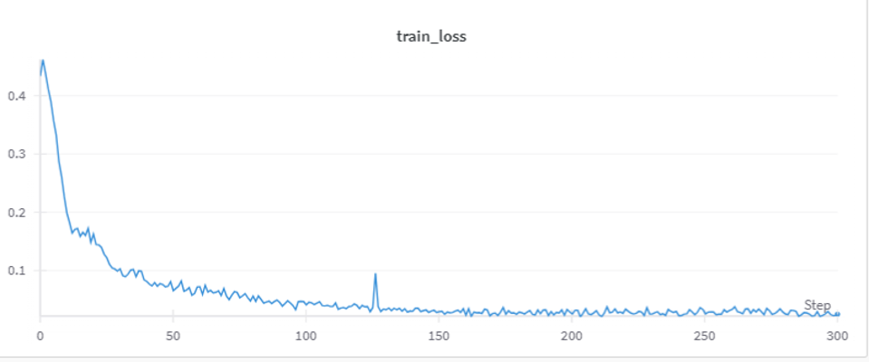

# Adversarial Diffusion Policy for Observation-Based Learning
### 基于观测学习的对抗扩散策略

> **Teaser:** A novel framework that recovers robust manipulation policies exclusively from vision-only expert sequences, completely eliminating the need for explicit action supervision.
> 
> *简介：一个仅利用纯视觉专家序列即可恢复稳健操作策略的新型框架，完全无需显式的动作监督数据。*

---

## 🚀 Motivation: Why Learn from Observation?
**(动机：为什么选择基于观测的模仿学习？)**

Traditional Imitation Learning (IL) heavily relies on high-quality action-state pairs, which are expensive and difficult to collect. Our approach shifts the paradigm to **Imitation Learning from Observation (IfO)**.

*传统的模仿学习 (IL) 严重依赖于高质量的“动作-状态”数据对，这类数据收集成本高昂且困难。我们的方法将范式转移到了**基于观测的模仿学习 (IfO)**。*

*Figure 1: Traditional IL vs. Our IfO Pipeline. (图1：传统模仿学习与我们的 IfO 管线对比)*

As shown above, instead of directly matching predicted actions ($a_t$) with ground-truth actions (which we assume are unavailable), our Diffusion Policy takes a history of observations ($O_{t-h}, ..., O_t$) to predict a sequence of future actions. The policy is optimized by minimizing the discrepancy between these predicted visual states and the actual expert video sequences.

*如上图所示，我们的模型不再直接将预测动作与真实动作（假设不可用）进行匹配。我们的扩散策略接收历史观测序列，并预测未来的动作序列。策略通过最小化这些预测视觉状态与真实专家视频序列之间的差异来进行优化。*

---

## 🧠 Adversarial Training Architecture
**(核心架构：对抗训练机制)**

To effectively align the agent's behavior with the expert's state distribution, we introduce an adversarial learning objective combining Conditional Diffusion Models with GANs. We explore two distinct pathways for observation matching:

*为了有效地将智能体行为与专家状态分布对齐，我们引入了一种结合了条件扩散模型与 GAN 的对抗学习目标。我们探索了两种不同的观测匹配路径：*

### 1. Adversarial Discriminator / 对抗判别器

A visual-feature discriminator acts as a reward generator, evaluating the predicted observation sequences. The Diffusion Policy acts as the generator, learning to produce action sequences that lead to visually indistinguishable states from the expert. This method significantly filters out local drift noise.

*(视觉特征判别器作为奖励生成器，对预测的观测序列进行评估。扩散策略作为生成器，学习生成能导致与专家视觉状态难以区分的动作序列。此方法有效过滤了局部漂移噪声。)*

**Training Stability (训练稳定性):** Both our generator and discriminator networks show rapid and stable loss convergence during training. *(在训练过程中，我们的生成器和判别器网络均表现出快速且稳定的损失收敛。)*

  
  

  <em>(Left: Discriminator Loss. Right: Generator Loss. / 左：判别器损失，右：生成器损失)</em>

### 2. Feature MSE / 特征均方误差

A baseline approach directly computing the Mean Squared Error between the predicted and ground-truth visual features.

*(一种基线方法，直接计算预测视觉特征与真实特征之间的均方误差。)*

**Training Stability (训练稳定性):**

  

  <em>(Network Training Loss / 网络训练损失)</em>

---

## 📊 Quantitative Highlights
**(定量分析亮点)**

Evaluated on the `robomimic lift` dataset in the MuJoCo simulation environment, our Adversarial Diffusion Policy achieved:
*在 MuJoCo 仿真环境的 `robomimic lift` 数据集上进行评估，我们的对抗扩散策略实现了：*

- 🔥 An **85% success rate** in solving the manipulation task. *(在操作任务中达到 **85% 的成功率**。)*
- 📈 Retained **91% of the performance** compared to a fully supervised expert baseline that had access to complete action data. *(与拥有完整动作数据的完全监督专家基线相比，保留了 **91% 的性能表现**。)*

